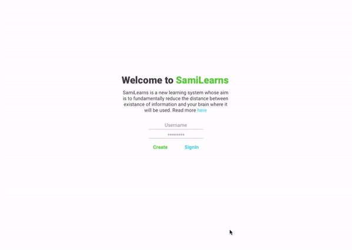

# SamiLearns

PoC code for SamiLearns whose aim is to fundamentally reduce distance between existance of information and brain where it will be used. You can read in more detail [here](https://coda.io/@yash-bonde/learning-system).



### Usage

To use this service you need to have `python3` installed, hopefully you are using either linux or macos based system. Next, I reccomend that you use that `virtualenv`. Run the following commands when using it for the first time:
```shell
python3 -m venv venv # one time only
source venv/bin/activate
pip3 install -r requirements.txt
python3 -m spacy download en_core_web_md
chmod +x runserver.sh # blunt
./runserver
```

There will be other things that might need to be installed along the way so do follow those. This setup is more suited to docker style. Also it is a good habit to run `pip3 install -r requirements.txt` everytime you make a new pull. From every following usage simply run the following commands:
```shell
./runserver.sh
```

## Pieces

This is the full-stack project and so requires learning along the way, moreover this requires some serious innovation in the following:
1. Notebook UI and UX so this can truly become your digital copy
2. Search and Aggregation: Moving ahead from not just lexical and semantic searching but a new domain.

## TechStack

We aim to use the latest tech stack so as to ensure bets quality of information, for this we are using:
1. `fastapi` for backend server maintainance
2. `pytorch` instead of `tensorflow`, for it's ease and simplicity of use

## Outcome

I am the outcome to be a system that is atleast 2x better at gathering information than current sources (`pre-alpha`). Overal aim with this idea is to have `10x by V1` and `100x by V2` improvement in learning speed of a human. For this specific outcome I aim for the following:

- [X] Complete a 3-part webpage that reduces the clicking time to get to information from the point of login
- [ ] A Template system for different learing patterns
- [X] A tuning system that is a new way to interact with the AI that gives you information, this is a new innovative solution that lays the foundation for our interactive AI system
- [X] Throw links at the system and then it goes and reads those links, so need a general web-scraper engine. This needs to be ambivalent to the website because we may get any website' data (built partially, still not very smart but okay atleast helps in getting the strings)
- [ ] A simple AI system (pref. non DL) that takes in the raw data and queries the existing APIs for more NLP information and makes a strucutred query-able information from it.
